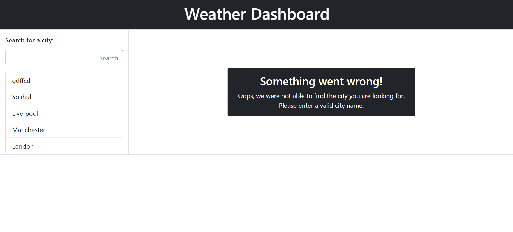

# Weather Dashboard

## Table of Contents

[Description](#description)  
[Technologies Used](#technologies-used)  
[Link to Deployed Application](#link-to-deployed-application)  
[Getting Started](#getting-started)  
[Screenshots](#screenshots)

## Description

This project used Bootstrap and jQuery to create a dynamically rendered weather dashboard which retrieves weather information from the Open Weather API. The user must type in a city in the search input and this will dynamically render the weather data by making two calls to the API, one to the Current Weather API and the other to the One Call API. As well as this, the city is saved into local storage and displayed in the search history list. The user can then click on a city in the search history list to render the weather data for that city again.

The UV index information in Current Weather changes colour depending on the severity of the UV. Low being green, moderate being orange and severe being red.

If an invalid city is entered or the fetch request could not be fulfilled, an error message is displayed.

## Technologies Used

- HTML5
- CSS
- Bootstrap
- JavaScript
- jQuery
- Open Weather API

## Link to deployed application

Click [here](https://chelseanicholls95.github.io/weather_dashboard/) to view project.

## Getting Started

```
git clone git@github.com:chelseanicholls95/weather_dashboard.git
cd weather_dashboard
code .
```

## Screenshot



